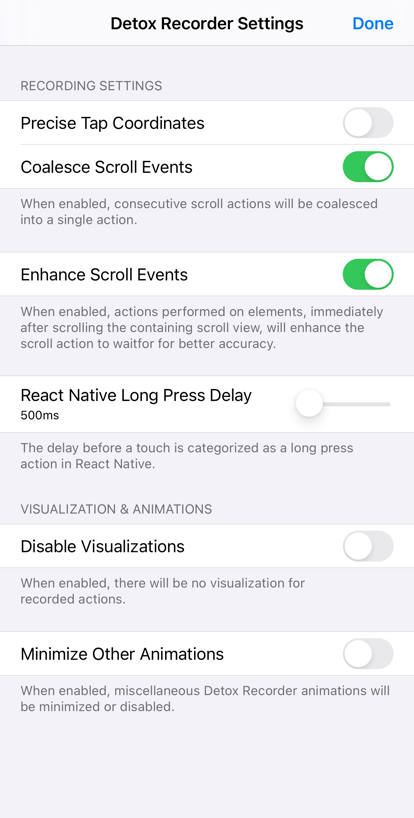

# Recording Settings

Tapping on the **settings button ()** in the recording bar will display the Recording Settings screen:

**Precise Tap Coordinates** enables recording taps at precise (x, y) coordinates, instead of normal `tap()` commands. Disabled by default.

**Coalesce Scroll Events** enables coalescing consecutive scroll actions into a single scroll action, containing the total scrolling delta. Enabled by default.

**Enhance Scroll Events** enables enhancing scroll actions into `waitfor` actions, if followed by actions performed on elements contained in the scroll view. Enabled by default.

**React Native Long Press Delay** sets the touch delay, after which the touch is considered a long press, rather than a tap. By default, the value is 500ms.

**Disable Visualizations** disables visualizations after each recorded event. Disabling visualizations is not recommended, since matching estimation is also disabled.

**Minimize Other Animations** minimizes or disables certain Detox Recorder animations, such as the take screenshot animation.

**Detox Version** sets the minimum Detox version to support in recorded test files. Setting to the newest supported Detox version will result in improved element matching logic as well as additional additional actions supported. **Note:** Make changes to this setting before recording any action. Once an action has been recorded, the Detox version will be locked for the duration of the recording.