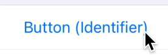
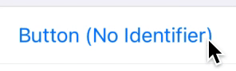
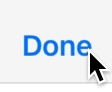
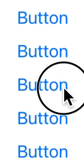

# Detox Recorder

Detox Recorder is a utility for recordings steps for a Detox test as you use your app in Simulator. After recording the test, add expectations that check if interface elements are in the expected state.


Detox Recorder can work with any app installed on your simulator, or use the information in your Detox configuration to install and launch your app.

#### Supported Detox Actions

- Interaction with system controls
- Scrolling
- Scroll to top
- Taps and long presses using gesture recognizers
- Adjusting date pickers
- Adjusting picker views
- Text input
- Adding comments to test
- Taking a screenshot

#### Known Limitations

- Complex gestures such as pans, swipes and zooms are not supported
- Interactions with system alerts (such as permissions and authentication) are not supported
- Interactions with map views are not supported
- Interactions with web views are not supported
- It is not possible to deduce the delay of long press in RN gestures; use the settings screen to define a delay suitable for your app

### Requirements

- macOS 10.15.4 and above
- Xcode 11.0 and above
- [applesimutils](https://github.com/wix/AppleSimulatorUtils) 0.7.6 and above

### Installation

1. If you haven't, [install Detox in your project](https://github.com/wix/Detox/blob/master/docs/Introduction.GettingStarted.md).

2. Install Detox Recorder:

   ```bash
   npm install detox-recorder --save-dev --no-package-lock
   ```

### Recording

Detox Recorder is operated from the command-line, using the `detox recorder` command in your app's folder. It can record interactions in any app installed on your simulator (including Apple's stock apps), or use the information in your Detox configuration file to install and launch your app.

**Note:** Detox Recorder produces Detox 17.0+ compatible test files.

To use your Detox configuration to determine which app to record and on which simulator, run the following command:

```bash
detox recorder --configuration "ios.sim.release" --outputTestFile "~/Desktop/RecordedTest.js" --testName "My Recorded Test" --record
```

Or, alternatively, to start a recording of an already installed app, run the following command:

```bash
detox recorder --bundleId "com.example.myApp" --simulatorId booted --outputTestFile "~/Desktop/RecordedTest.js" --testName "My Recorded Test" --record
```

You app will launch and start recording your actions to the specified test file.

For an in-depth look at the command line arguments, run the following command for full documentation:

```shell
detox recorder --help
```

### Interaction Recording

When interacting with elements in your app, Detox Recorded will visualize each interaction with a short animation to signal the interaction type. This visualization will be colored depending on how accurately and uniquely Detox Recorder estimates the matching of the UI element is.

**Note:** Detox Recorder makes this estimation according to internal heuristics it runs when observing the interacted UI element. This estimation may not be 100% accurate. Always inspect the resulting test file to ensure element matching is correct.

<span style="color:green">**Green**</span> visualizations signify unique elements with a very small chance of mistaken matching in the future.



<span style="color:#fcba03">**Yellow**</span> visualizations signify elements that are unique enough at the time of recording, but have some chance of being incorrectly matched as you update your app's UI elements.



<span style="color:orange">**Orange**</span> visualizations signify elements that are unique enough at the time of recording, but have higher chance of being incorrectly matched as you update your app's UI elements.



<span style="color:red">**Red**</span> visualizations signify elements that are not unique, and have high risk of being incorrectly matched in the future.



It is recommended to strive for <span style="color:green">**green**</span> elements as much as possible by adding unique identifiers to your elements. As much as possible, try to avoid having <span style="color:red">**red**</span> elements in your recordings.

#### Recording Controls

During recording you will see that a new bar is displayed at the top of the screen. This bar contains recording controls that add additional functionality, as well as settings to augment the recording experience in your app. You can collapse the bar to minimize its interference with your content.


- The **take screenshot button ()** adds a screenshot command to your test. Long press on the button to give the screenshot a custom name.
- The **add comment button ()** adds a comment to your recorded test's code.
- The **tap type button ()** switches tap recording from normal to precise and vice-versa. See [Recording Settings](Documentation/RecordingSettings.md) for more information.
- The **settings button ()** displays the recording settings screen. See [Recording Settings](Documentation/RecordingSettings.md) for more information.
- The **stop button ()** stops the recording.

### After Recording

After finishing your recording, add expectations that check if UI elements are in the expected state. See [Expectations](https://github.com/wix/Detox/blob/master/docs/APIRef.Expect.md) for more information.